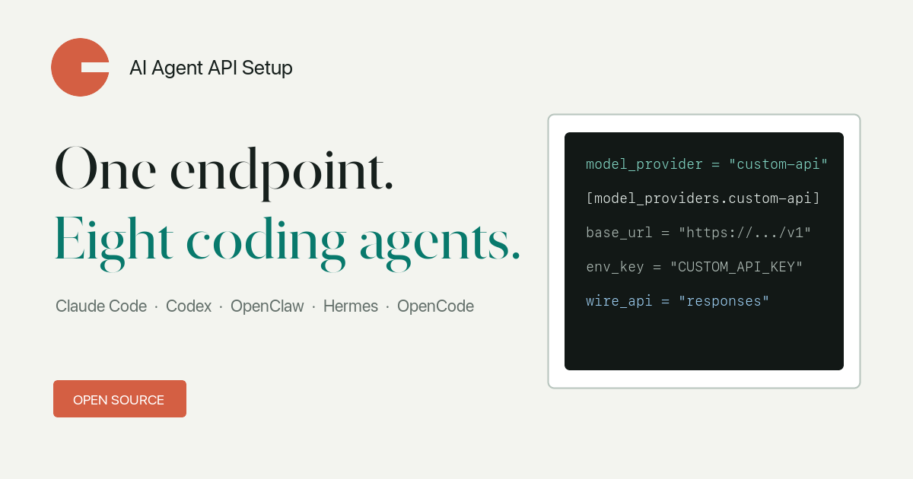

<p align="center">
  
</p>

<h1 align="center">AI Agent API Setup</h1>

<p align="center">
  为 Claude Code、Codex、OpenClaw、Hermes Agent、OpenCode、Cursor、Cline 和 Aider
  生成并检测自定义 AI API 配置。
</p>

<p align="center">
  <a href="https://omniakey-com.github.io/ai-agent-api-setup/"><strong>打开在线配置生成器</strong></a>
  · <a href="README.md">English</a>
  · <a href="LICENSE">MIT</a>
</p>



输入 Base URL 和模型 ID，即可得到对应客户端的配置文件、Shell 片段或经过核对的
界面操作步骤。网页不要求填写 API Key，生成结果只引用你本机的环境变量。

## 支持范围

| 客户端 | OpenAI Chat | OpenAI Responses | Anthropic Messages | 输出 |
|---|:---:|:---:|:---:|---|
| Claude Code | - | - | 支持 | Shell 环境变量 |
| Codex | - | 支持 | - | `~/.codex/config.toml` |
| OpenClaw | 支持 | 支持 | 支持 | `~/.openclaw/openclaw.json` |
| Hermes Agent | 支持 | 支持 | 支持 | `~/.hermes/config.yaml` |
| OpenCode | 支持 | - | - | `opencode.json` |
| Aider | 支持 | - | - | Shell 环境变量 |
| Cursor | 支持 | - | - | 已核对的界面步骤 |
| Cline | 支持 | - | - | 已核对的界面步骤 |

CLI 还支持检测 Gemini 的模型列表接口。各客户端采用的上游配置契约见
[references/client-contracts.md](references/client-contracts.md)。

## 在线工具

<https://omniakey-com.github.io/ai-agent-api-setup/>

这是纯静态网页，不发送 API 请求、不保存表单内容，也不会把密钥写进 URL。客户端、
协议和公开 Profile 可以通过 URL 参数分享。

## CLI

需要 Node.js 20 或更高版本，可以直接从 GitHub 运行：

```bash
npx github:omniakey-com/ai-agent-api-setup list
```

生成 Codex 自定义 Provider：

```bash
npx github:omniakey-com/ai-agent-api-setup render \
  --client codex \
  --protocol openai-responses \
  --base-url https://gateway.example.com/v1 \
  --model gpt-example \
  --key-env CUSTOM_API_KEY
```

在本机导出 Key 后检测认证和模型列表：

```bash
read -s CUSTOM_API_KEY
export CUSTOM_API_KEY
npx github:omniakey-com/ai-agent-api-setup doctor \
  --protocol openai-responses \
  --base-url https://gateway.example.com/v1 \
  --key-env CUSTOM_API_KEY
```

隐藏输入可以避免密钥进入 Shell 历史；CLI 也故意不提供 `--api-key` 参数，避免密钥进入
进程列表。

## Agent Skill

仓库根目录的 [SKILL.md](SKILL.md) 是可复用的 Agent 工作流。Codex 可以安装到个人
Skill 目录：

```bash
git clone https://github.com/omniakey-com/ai-agent-api-setup.git \
  ~/.codex/skills/ai-agent-api-setup
```

随后可以直接要求：

```text
使用 $ai-agent-api-setup，把 Codex 接到我的 Responses 兼容网关。
```

## Profile

默认 Profile 是通用自定义端点。Profile 使用普通 JSON，保存公开 Base URL、模型占位符
和 API Key 环境变量名。OmniAKey 只是一个可选示例，生成器不会强制或优先使用它。

## 本地开发

```bash
npm test
npm run build
python3 -m http.server 4173 --directory _site
```

项目没有运行时包依赖。CI 会覆盖所有公开声明的客户端/协议组合并构建 GitHub Pages。

## 安全与许可

安全报告方式见 [SECURITY.md](SECURITY.md)。项目采用 [MIT License](LICENSE)。
